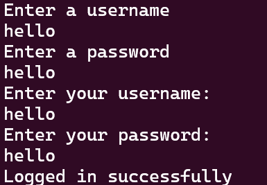
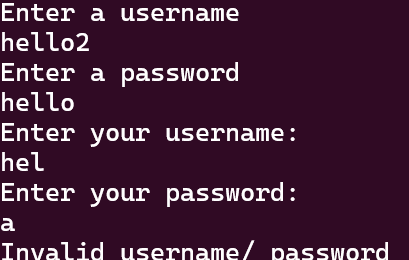

# Login Python Tutorial
# This is a tutorial in Python of how to create a simple login.
This has more security features like hashing and encoding and some other stuff.

⚠️ WARNING: Do NOT USE THIS FOR BUSINESS PURPOSES. I am not a professional coder so i'm just using my very basic knowledge.

Go to pull requests and go to the branch that has revert to see the one without hashing (more simpler).

You want to create a simple login thing in Python but don't know how to do it?
here you go. With more advanced stuff like encoding...

First, open a text editor. you can use VS Code, like me, but you can also use 
Notepad++, the normal Notepad, or any other thing that works for you.

Make a file if you haven't already. 

Rename your file to login.py. You can search up how to rename for your local text editor.
In Notepad++, I'm aware that it is File > Rename. 

This will automatically change the input language format to Python as it uses the .py
extension, however for some primitive text editors it does not.

Now, follow as i do.
(Alternatively, copypaste from login.py found in this github repo.)
```
# This is a comment. This won't be printed out to console. 

print("Enter a username") # prints the text 'Enter a username' to console
usr = input() # records the user's input and saves it to the variable 'usr'. <-- short for 'user'/ short for 'username'.
hshusr = hash(usr) # hashes the thing so more secure. convenient, isn't it?
print("Enter a password") # prints the text 'Enter a password' to console
pss = input() # records the user's input again and saves it to the variable 'pss' <-- short for password.
hshpss = hash(pss) # hashes the password into an obscure number so bye bye hackers i guess

# Now for login guessing time...

print("Enter your username:") # prints the text in quotation marks, as you might guess
USRGUESS = input()# variable in capitals usually highlights a constant (variable that never changes) but i just tried to emphasise it.
print("Enter your password:") # same as what you expect
PSSGUESS = input() # user's password guess.
hshuguess = hash(USRGUESS) # changes the user's guess to hash
hshpguess = hash(PSSGUESS) # changes the pass guess to hash

if hshuguess == hshusr and hshpguess == hshpss: # if the hash of the username guess is EQUAL to the hashed username and the hash of the password guess is EQUAL to the hashed password...
    print("Logged in successfully") # successful login
else:
    print("Invalid username/ password") # uh oh, fail!
    
# hash brown lesson
# i mean HASH!!

```
    
Yay! Now you have a very barebones BUT secure login in Python. To run it, install python/python3 on your pc's console and run it that way (follow tutorials online on how to install it)
at: https://www.python.org/downloads/

OR 
Run it in an online compiler.

The output should be something like this: 

OR

something like this: .

There you go! That's your first login in Python. And you can keep the ahckers away for a bit i guess.

More tutorials coming soon...
